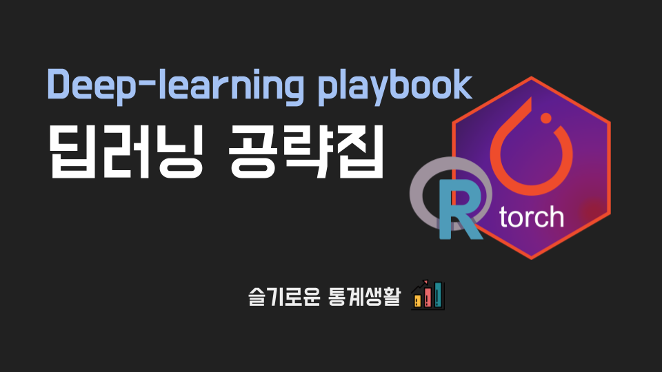
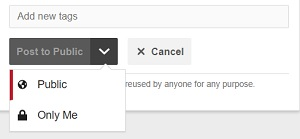

# 들어가며 {.unnumbered}



이제까지 R에서의 딥러닝은 Python의 라이브러리들을 `reticulate` 패키지를 이용하여 빌려온 형태였지만, [torch for R](https://torch.mlverse.org/) 패키지는 C 라이브러리를 Torch를 기반으로 R을 wrapper 언어로서 사용하여 패키지를 만들었다. 즉, Torch + Python = PyTorch, Torch + R = RTorch가 되는 셈이다.

## 공략집 사용법 {.unnumbered}

현재 웹상에 공개된 딥러닝 공략집에는 `hypothesis`라는 오픈소스 프로그램을 이용한 **중요부분 표시(highlight) 기능과 주석 달기(Annotate) 기능**이 구현되어 있다. 

-   중요표시, 주석달기: 읽다가 중요하거나 나중에 따로 보고싶은 기능의 경우, 드래그를 하면 다음과 같은 선택 버튼이 나온다. 형광펜 긋고 싶은 경우 `Highlight` 선택, 주석을 달고 싶은 경우 `Annotate`을 선택하자.


-   하이라이팅 on/off: 가끔은 하이라이팅 해 놓은 것들을 없애고 글 만 읽고싶은 경우가 있을텐데 그 때엔 오른쪽 상단 동그라미에 점이 찍혀있는 버튼를 클릭하면 하이라이팅 된 것이 사라진다.

-   주석 공개/비공개: 주석은 필자와 다른 독자가 볼 수 있도록 `public`하게 남길 수도 있고, 자신만 볼 수 있게끔 private으로 설정 할 수 있다.



-   주석 기능을 이용하여 필자에게 피드백을 줄 수 있다. 오타나 오류 발견시 주석을 달아주시면 필자가 주기적으로 체크해서 고쳐나가도록 하겠다.

<div class="rmdnote">
<h3 id="알아두기">알아두기</h3>
<p><strong>하이라이팅과 주석들을 나중에 따로 볼 수 있다.</strong> 자주 방문하시는 분들은 가입하시고 사용하시면 여러모로 편할 것이다.</p>
</div>


## 설치하기 {.unnumbered}

설치 역시 간단한다. 여느 R패키지와 같이 `install.packages()` 함수를 사용하면 된다. 서브 라이브러리인 `torchaudio`와 `torchvision`이 있으나, 책의 뒷부분에서 다루기로 한다.


```r
install.packages("torch")
# 혹은 개발버전을 다운 받고 싶다면 다음의 코드를 사용한다.
# devtools::install_github("mlverse/torch")
```


## 기본 패키지 {.unnumbered}

앞으로의 내용에 있어서 다음의 두 패키지는 기본으로 불러와서 사용하는 것을 약속으로 한다.


```r
library(tidyverse)
library(torch)
```
